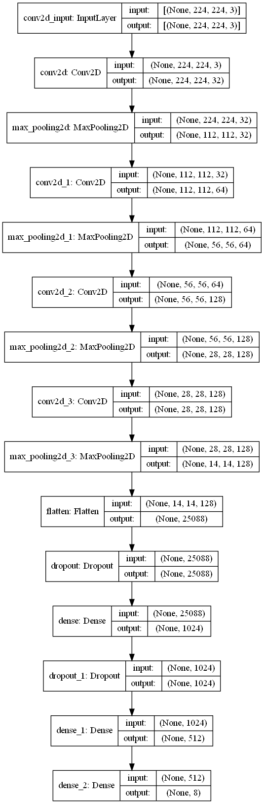
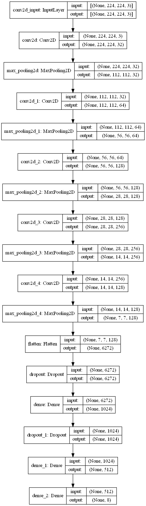

# FlowerClassification-Recommendation
## Tasks in this project: 
To correctly classify unseen images as one of the eight types of flowers above. From an input flower image, recommend 10 more images of similar flowers (of the same type and must be visually as similar as possible). Also, there will be one model for flower classification only and one for flower recommendation.

## About Dataset
### Dataset Description:
In dataset folder, there are 2 datasets, one is real dataset which is Flowers in Flowers zip file, and one is additional dataset which is FlowersAdded zip file. Also, these datasets contain 08 types of flowers:
- Baby
- Calimero
- Chrysanthemum
- Hydrangeas
- Lisianthus
- Pingpong
- Rosy
- Tana
### Dataset Issued:
- Images are of different sizes, aspect ratios, format, may include transparency, and may include other subjects such as people, containers, etc., in addition to the flower.
- There is a lot of data duplication (identical images).

## Data Source
Our data is organized in the "/Dataset" directory:
- Main flower dataset: "/Dataset/Flowers.zip"
- Additional flower dataset from web scraping to handle data imbalanced (optional): "/Dataset/FlowersAdded.zip"
(you can add your data from your own data or from CrawData directory)

## Technology/Infrastructure/Models
### Technology Stack
#### Programming Languages
- Python: Utilized for data analysis, manipulation, and visualization.
- 
#### Libraries/Frameworks
- **Pandas:** Pandas is a powerful data manipulation and analysis library for Python, essential for handling structured data efficiently.
- **NumPy:** NumPy is fundamental for numerical computing in Python, providing support for large, multi-dimensional arrays and matrices, along with a collection of mathematical functions to operate on these arrays.
- **Matplotlib:** Matplotlib is a versatile plotting library that enables the creation of a wide variety of plots and visualizations, essential for data exploration and presentation.
- **TensorFlow:** TensorFlow is an open-source machine learning framework developed by Google, widely used for building and training deep learning models across a range of tasks.
- **Tensorflow - Keras:** Keras is a high-level neural networks API, built on top of TensorFlow, that provides a user-friendly interface for building and training deep learning models.
- **Sci-kit Learn:** Sci-kit learn is a simple and efficient tool for data mining and data analysis, offering various algorithms and tools for machine learning tasks such as classification, regression, clustering, and dimensionality reduction.
#### Web Scraping
- **Selenium:** Selenium is a powerful tool for automating web browsers, often used for web scraping and testing web applications.
- **BeautifulSoup:** BeautifulSoup is a Python library for pulling data out of HTML and XML files. It provides simple methods and Pythonic idioms for navigating, searching, and modifying a parse tree.

#### Machine Learning Models
- **Deep Learning Models:** Building convolutional neural networks (CNN) using TensorFlow and Keras for image classification tasks.
- **Model Evaluation:** I employ fine tuning for Adam optimizer as well as Early Stopping function in order to evaluate and improve the performance of my models.

### Model Architecture

|Flower Classification                           |Flower Recommendation                            |
|------------------------------------------------|-------------------------------------------------|
|| | 

### Training
The model is trained using the training dataset with the objective of minimizing a categorical cross-entropy loss function. During training, the model's weights are adjusted iteratively using the Adam optimizer.

#### Training Parameters
- Batch Size: 32
- Image size: 224 x 224
- Optimizer: Adam
- Number of Epochs: 45
- Learning Rate: 0.001
